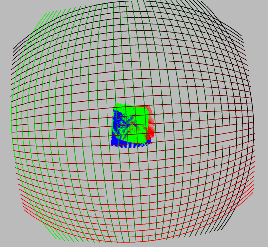

# Mapping Rectangles on Spheres...

Live Demo : https://d3x0r.github.io/STFRPhysics/3d/indexSphereMap.html

This demo started as a test to map a rectangular grid onto a sphere using latitude longitude offset
from a single 'orientation point'.  The 'orientation point' is at a specific latitude and longitude on the ball, with
a spin/twist setting to control the 'heading' of the patch.  

I then plotted the rotation coordinate and its basis frame, and then there was a lot of discontinuity in output.
Adding fixups internally on the point already in the rotation space.  

This is an application where addition is the 'proper' operation too, in order to form the grid, one can
either apply latitude and then longitude, or vice versa; or apply infinitesimal steps of each to get the result;
this happens to be the result of adding two rotations.  https://en.wikipedia.org/wiki/Lie_product_formula ,  

Then applying the origientation point's rotation ( which for some grids is a simple addition of the 

