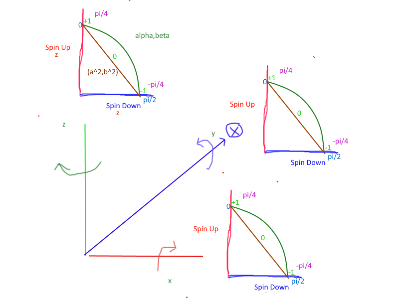

# Pauli Matrices, spin calculations

Really I blame this guy for all the understanding I've gained...

https://www.youtube.com/channel/UCZSC7wgBq3RSLKoJDfGL0Rg/videos User: NoahExplainsPhysics

- https://www.youtube.com/watch?v=ACZC_XEyg9U  "Dirac's belt trick, Topology, and Spin ½ particles"
- https://www.youtube.com/watch?v=10qvMocHFZg  "Quantum Spin (3) - The Bloch Sphere" 
- https://www.youtube.com/watch?v=qDaoV5S9oTE  "Quantum Spin (2) - Pauli Matrices"
- (probably 1 also...)

## The demo

None of the sliders and options really apply to this; it's just a copy from other demos; and is left a little ugly.

[Cuboid...](https://d3x0r.github.io/STFRPhysics/3d/index5.html)

## The breakdown...

The spin probabilities are computes as two orthagonal axii that are related through a proportionality.

The alpha and beta factors are a unit complex number, so it's easily represented with an angle.

There's 3 complex probabilities, one for each axis ( because rotations are 3 angles, not 2, so a rotation vector in 3 space is just 3 angles, which can be computed
what the probability of that is there.

The unit-vector normalization of (x,y,z) with (xx+yy+zz)=1 ends up applying the correct changes to the other axises such that
(1,0,0) is 100% in one direction, but only 50-50 in the other direction.  

At 0 angle along an axis, there's a 50-50 chance of being detected as 'up'.

Screenshot from the Demo above... marked with some points of interest of least and most probabilities...

