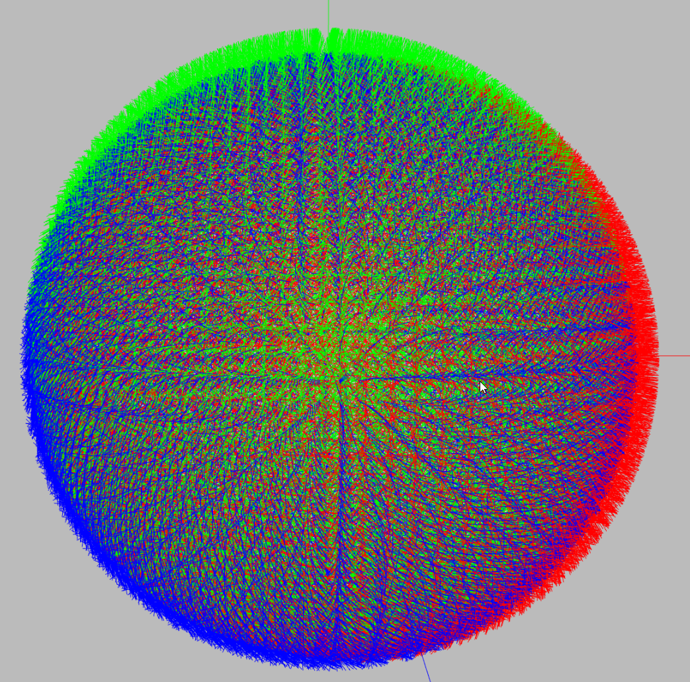
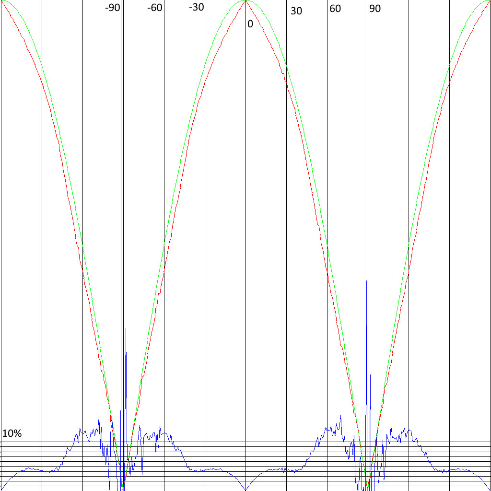

# Spin Detection and Spin Probabilities

QM has math, that predicts a degree of correlation at a detector vs another detector.  The first section runs through some introductory matrerial that regard quantum mechanical calculations.
The second section is a refomulation based on a non-digital hidden variable, that has its own predictions.

The QM Math section and the LHV section are not equivalent; and really calculating with Spin Axis will back-propagate through the math a little.

Mostly this just deals with the so-called entanglement of particles; and that they somehow communicate instantaneously at distant locations.  The simple geometric solution of using their spin axis with a dot product of the detectors
results with a ratio `1-(x/(2-x))` which is the amount of correlation for a degree of sepration of two detectors.   If the detectors are polarized filters, then the 1/2 overlap is 2 quaters seprated by 180 degrees; if they are Stern Gerlach,
then the degree is the degree of the detector, and 1/2 up and 1/2 down still works.  If they are positron electron pairs, I can further state that they have the same spin axis, but opposite spin signs/ directions; the 'spin down' detected in that state
does not reflect the axis direction inversion, merely the rotation direction around that axis.


# Section 1 - QM Math

## Pauli Matrices, spin calculations

Really I blame this guy for all the understanding I've gained...

https://www.youtube.com/channel/UCZSC7wgBq3RSLKoJDfGL0Rg/videos User: NoahExplainsPhysics

- https://www.youtube.com/watch?v=ACZC_XEyg9U  "Dirac's belt trick, Topology, and Spin ½ particles"
- https://www.youtube.com/watch?v=10qvMocHFZg  "Quantum Spin (3) - The Bloch Sphere" 
- https://www.youtube.com/watch?v=qDaoV5S9oTE  "Quantum Spin (2) - Pauli Matrices"
- (probably 1 also...)


### The demo

None of the sliders and options really apply to this; it's just a copy from other demos; and is left a little ugly.


### The breakdown...

The spin probabilities are computes as two orthagonal axii that are related through a proportionality.

The alpha and beta factors are a unit complex number, so it's easily represented with an angle.

There's 3 complex probabilities, one for each axis ( because rotations are 3 angles, not 2, so a rotation vector in 3 space is just 3 angles, which can be computed
what the probability of that is there.

The unit-vector normalization of (x,y,z) with (xx+yy+zz)=1 ends up applying the correct changes to the other axises such that
(1,0,0) is 100% in one direction, but only 50-50 in the other direction.  

Taking the normalized (unit vector) direction, each component results in a spin-up probability of:

```
f(x) = sin( (1+x) * PI/4 )^2
```

At 0 angle along an axis, there's a 50-50 chance of being detected as 'up'.

The position along each axis from 0 to 1 is the chance a detection along that axis results in 'up' detected... for example: along the X axis a axis that goes directly negative has a 0 percent chance of being 'up', but 
any other axis up to the ones halfway, which are perpendicular to the detector have a 50-50 chance of being detected as up or down.  This is partially due that in that area, the other spin axii are not specifically accounted for, but are 
lumped to a sum probability; and the `sin(position on sphere) * sin(position on sphere)` covers the volume of probabilities around that point. (probably need to expand on this later... it's accounting for a 3rd dimension that's equivalent to one
of the existing dimensions, while working on a 2D projection of the system...  )

[Demo](https://d3x0r.github.io/STFRPhysics/3d/index5.html)


Screenshot from the Demo above... marked with some points of interest of least and most probabilities...


### Single Detector Graphs

This graph of the above function `f(x) = sin( (1+x) * PI/4 )^2`, for a single axis projection, looks like this.

Where -1 to 1 along the X is the unit spin axis projected on the X axis.  This value (x) to the function is usually a non-linear value, such as a coordinate of a unit direction vector projected on another direction vector, 
or the dot or cross product of unit vectors.


Delinearizing X with sin`sin(x*pi/2)` lets the 2d graph more flat, so the X coordinate then is just an angle, or really portion of a quarter turn.

`g(x)= f( sin(x*pi/2) )` this replaces X from -1 to 1 linear with X -1 to 1 as a dot product, which is the sin of the angle between two unit direction vectors. `(sin(-pi/2 to pi/2))` scales the from `(-1,-1 to 1,1)`; but changes the slope.

In this case, the dot product of the spin detectors is `1` when aligned, and `0` when not aligned.  This is a factor that results in the similarity of the measurements.


However, the coordinates of a direction vector are already similar to sin/cos limited functions, `xx+yy+zz=1`; which are spherical/circular in nature.

~~On this second graph `pi/8 = 0.8943`;~~ 


---

# Section 2


## Single Detector Graph

Spin probabiities for LHV are just the spin axis dotted on the detector vector.  If the vector si down, then it is negative or inversed-relation probability.

[Demo](https://d3x0r.github.io/STFRPhysics/3d/index5-spin)




## Contention with Bells Math

This is one of many sources that explain Bells Inequality, and the calculation, and terms that go into it:
[23:16 / 51:29 017 Einstein-Podolski-Rosen Experiment and Bell's Inequality](https://youtu.be/uef_qN7VFuY?t=1394) "sigma(V,A)" as used in this video is NOT a probablistic quantity, it is itself +/- 1/2; 
this makes it a digital variable which before detection can only have 1 of 2 values.   The hidden varaible is a analog value from -1 to 1 though, which means this inequality doesn't have to apply to this hidden variable. 
Using the 'hidden variable' `V dot A * 1/2`  is not that V is 1/2 or -1/2, but a range of values. (or cos of the angle between the hidden variable and the detector alignment)

then the integral `( d^n V  P(V)  * simga_e(v,a) sigma_p(v, b ) )`  (sum all componnents, probability density, and the functions of that variable)

~~`sig_e(a)sig_p(b)-sig_e(a)sig_p(c)`~~

~~sig^2(v,b)= 0.25~~

~~(29:25).. and then inserting a 1.~~


### CHSH Inequality

CHSH is another way to defined Bells inequality that is more robust, and covers more choices; requires different angles than Bells Test does.

CHSH probability is S>2 = win; S < 2 is random coin.   S=4 is win 100% compatibility with truth   (A0 ~ B0)  (A0 ~ B0) (A1 ~ B0) (A1 !~ B1)

This is a nice short presentation of this idea: https://qubit.guide/9.3-chsh-inequality.html  (+9.4)

There are also many sources to get more information about this game...

Given this, then this setup models the supposed information.   At a 30 degree offset, QM predicts 86% correlation, while I only measure 80%, it's sufficient to get S > 2.74 or 2.4(ish) vs QM 2.828   CHSH.  The anti-correlation point
however, is free; because detectors at 90 degrees never correlate, and that's like a free point just for playing giving LHV 3.40 idealy, and 3.19 using CHSH test angles. (There is no perfect 4 point game).

If 90 degrees is setup for A1 and B1, then there is never a correlation between the two, and slicing the interior arc into 1/3 gives a separation of A0 and B0 of 30 degrees which again is a 83-86% correlation, 
and B0 with A1 is the same angle, as is B1 with A0, so they are all 3 equally valid.


### Relating Monte Carlo simulation with predicted QM


The green line is the predicted QM chance based on cos(angle) between detectors.  Red line is the Simulation value.  The blue line is the percent difference (100% at the top of the image; which makes this approx 10% error).
Angle divisions are shown every 30 degrees.




### Probability Calculation

The ratio of the arcs that overlap and don't overlap is really the same as the samples that will pass/fail.

Scaling 1 as '1/4 of a turn' or `*pi/2` equivalent for sin/cos functions, then the ratio of ( ( the union of arc A and B minus the angle ) over just the amount that overlaps; which ends up `(2-x - x)/(2-x)` or `1-(2x/(2-2x))`.


### CHSH Gamed

Local Hidden Variable (LHV).

In this graph, correlation of the chosen vectors vs the standard `V.A*V.B` chances has a greater than QM predicted chance of correlation; while still providing 0 correlation at 90 degrees.  60 degrees is like 30% greater than 50% chance (Bells Experimental Values) or like 65% correlation.
THe specific detector angles don't really matter, but greater than 30 degrees for chosing detector settings is a win... and at 30 degrees LHV with gamed vector set is the same chance as QM .  and only a little over 2% under correlated below 30 degrees.


I added a test in math/testCHSHGame

```
Array is : {A0, B0} got  [up-up,up-down,down-down,down-up], where up-up and down-down is expected to correlate
then {A1, B0}, {A0,B1}, {A1,B1}; where A1 and B1 are expected to not correlate, and penalize points.
choices: [
  [ 82760, 16467, 83915, 16858 ],
  [ 83026, 16753, 83629, 16592 ],
  [ 82708, 16519, 84071, 16702 ],
  [ 49649, 50130, 50460, 49761 ]
] [ 0.331465, 0.331365, 0.330945, -0.002405 ] [
  0.8010270662155631,   // ( 80% correlation)
  0.79821983475056,     // ( 80% correlation)
  0.8002732504715384,   // ( 80% correlation)
  0.009595052862557352  // ( 0% correlation = 100% non correlation = 1 point (almost, there is always slighly more ++ and -- at some point))
] 2.389925098575104

Ideal CHSH S for LHV : 3.40
```

so to disprove this hidden variable QM has to be > 3.4 (which is in theory possible)

