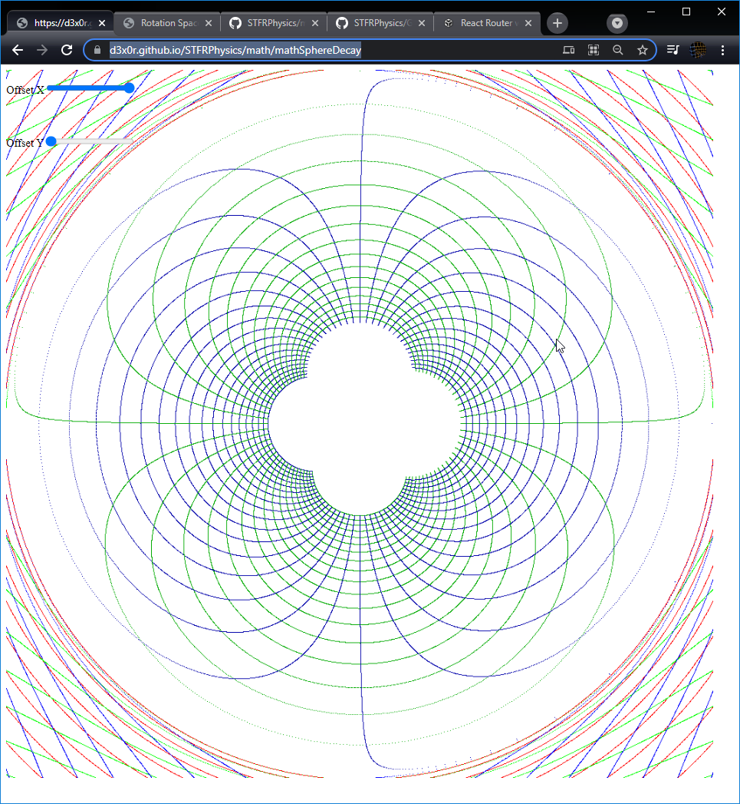
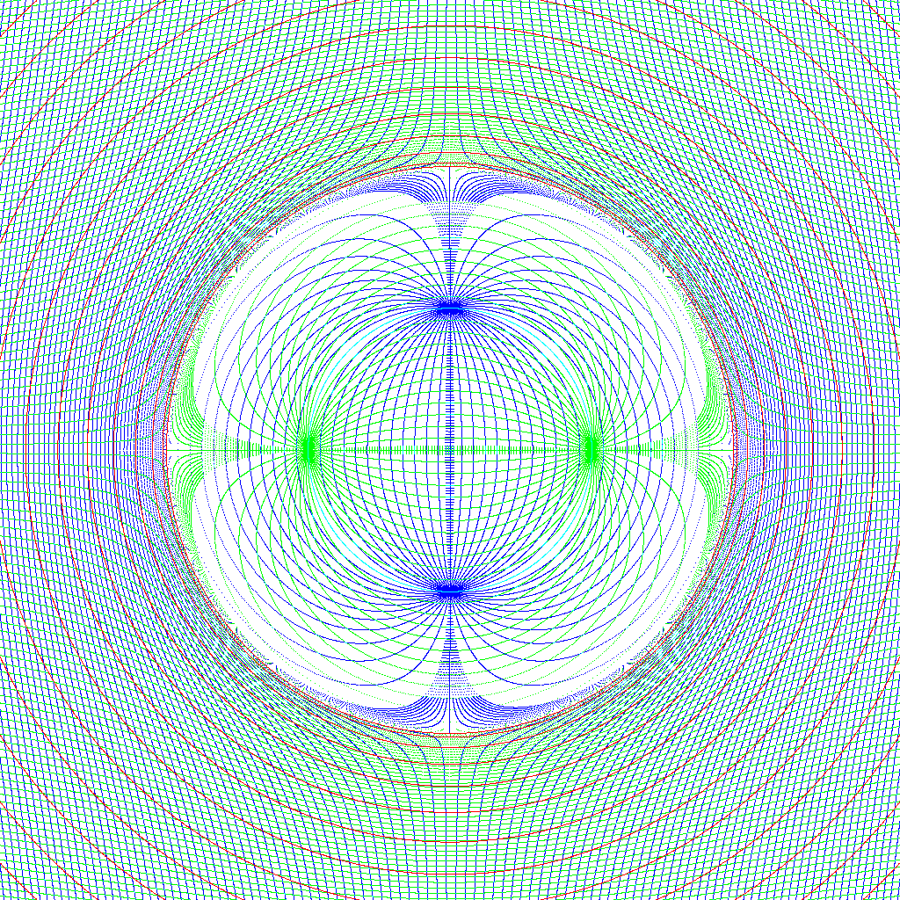

			   
			   
			   1) dimensions, coordinates
			   2) operations with numbers
			      + -
				  * /
				  cross
				  dot
				  
			   4) point rotations
			      4a) matrix
				  4b) inverse matrix
				  
			   5) Complex Failure (quaternion failure)
			   6) Matrix Failure 
			   7) axis-detector

Requirements: Algebra, Geometry, Complex numbers (basic knowledge of)

Proposition - forget a heap of what you know; take this for what it is, and don't try to make it what you have.
I've had what you have, and how you see and understand it; it has taken a while of tinkering to break that model,
and understand the system as it is.  

Nearly every model of dimensions, or metrics on spaces, is not this; that's not to say that in the end we don't end
up with a very similar model.  

From a start, numbers, and algebra on numbers as scalars or simple values is a given, and the math doesn't change any sort of meaning.

Combinations of numbers as vectors, and their interpretation starts to diverge.  
That is, somewhere around where numbers become analytic geometry.
Geometry of lines and curves in ratios and portions remain the same.

## 1D

A single axis, really starts already with 2 dimensions, or two quantitites: spot and angle, which can be combined to get span and spin.  
(thesaurus: spot: point, distance, location, position).  That is along a single axis, you have a distance from other spots that can be 
indicated, and you have a angle compared to other angles...

Origins: picking a constant known point, which all other references of position is taken from simplifies having to compute
the total sum of distance of known things.  For example there's 4 bodies A,B,C, and D, and A to B is 3 A to C is -3, C to D is 1, then
building various combinations of these points you can find a distance to any other combination, but if the were themselves all biased
against O=0, then A=1, B=4, C=-2, D = -1; and D to B is (D-B) or 5.  

This works similarly for angles, except every so often the angle overlaps itself, and is closed.  

Design Choice:  In classical math, angles are represented as arc lengths of a unit circle;  
a circle has a circumferance of 2pi, and a half-circumferance of pi.  The conversion to this system is 
simple; but this will not be the preferred units of angles to work with.  With regards to complex numbers, 'i'
is pi/2 or 90 degree rotation.

Design Choice: In this document, angles are represented as quarters of a circle.  
A circle has a circumferance of 4 quaters of a circle, and a half-circumferance of 2.
The radius of this circle is 2/pi instead of 1  (0.63662). 
Then also 1 is 90 degrees; sin(1)=1, cos(2)=-1, sin(-1)=-1, sin(3)=-1.... ).  Rough equivalence
of 'i' in this document is '1' in quater circles; but this is the angle, and not the sin(angle) as complex numbers are.
Complex numbers combine R or position with the arc, and mutually change each other; the equivalent numbers work differently,
and are more isolated; Position does not affect rotation or vice versa.)

(As a reminder A+Bi = r*(cos(t)+sin(t)i), where t is an angle 'theta'.)

Multiplication of a position and another position on the same axis does not mean a lot, same for division.  Multiplication with a scalar
or a time variable does make sense; the scalar might even itself be dependent on a position, but its units shouldn't be a position.  This
applies for angles or spin also.

This coodinate notation should be more like a tuple or vector with a group of independent values like (position,angle). 

Please forget that I mentioned anything about complex numbers, they don't apply here; similarly the polar notation association with them
should not be considered.

The position along the line is more like a graph from the left to the right, and the angle is +/-2 from that axis.  
The angle cannot change the position along the axis and the position cannot change the angle.  It might be considered like a cylinder
along the length; and might be viewed as a concetric circles with increasing radius, and lay out the polar graph similarly.

(deserves 2 example images here)

## 2D 

A second axis, gives two more values for position and spin.  `( (x,y), (X,Y) )`  The coordinates for position are grouped with other
coordinates of position; and components of spin are grouped together, forming essentially 2 vectors describing orientation and location in 
space.

These angles together define a position on a sphere;  Normally (0,0) spin would indicate a position that is perpendicular to the surface; 
that is mutually perpendicular to both axii that form the plane.  (If there is some extrinsic curvature ot the plane, that function will determine
what 'normal' is to the surface.)   This is called a surface normal, and in computer graphics is used to control the direction that light
reacts with.  The normal is directed by the twist around the X axis, 
and the twist around the Y axis that goether form a direction... where (2,2) is down from the surface.

These rotation axises do not work to handle rotation of 2D locations in the plane.  The x axis's rotation can only move the y position component, 
and then only by the `cos(x)` of its value.  It would make a line along the x axis oscillate towards the x axis, through the x axis to a 
minimum that's the -maximum it started at and back.  Similarly the Y axis can only shift points left and right.  You can accomplish some skewing,
but rotation a point at (1,1) will never make X or Y > 1, and on either axis, when rotated, the point (1,1) is (1.414,0) or (0,1.414).

So really we'll have to add another axis to handle the rotations of objects within the plane seprately, and we've already stepped to needing
part of the 3D dimensional rotation axis.

## 3D

A this axis, gives two more values for position and spin.  `( (x,y,z), (X,Y,Z) )`  The coordinates for position are grouped with other
coordinates of position; and components of spin are grouped together, forming essentially 2 vectors describing orientation and location in 
space.

But now we can also consider some other things about the spin axis.  [Euler's rotation theorem](https://en.wikipedia.org/wiki/Euler%27s_rotation_theorem)
says multiple rotations are combined into a single rotation.  This is true for individual rotations (23, 43, 52) also, where this is (23,0,0)+(0,43,0)+(0,0,52).
The axis that these represent may be rotated in some other direction, and they will still add to be a single rotation, around a single axis.

I will refer to the spin component group as a rotation vector.

This rotation vector, is usually kept in angle*(axis) sort of notation, because the unit axis is what's used in the calculations.  The
angle of rotation vector is `sqrt( XX+YY+ZZ)` or `sqrt(dot product with itself)`.   The vector (X,Y,Z) divided by the angle is a unit vector
indicating the direction of the spin.  

The angle may be positive or negative, but will not change from one to the other; a spin that is negative will always be negative.  

(delay til later) This
is specified to match the physical behavior of electrons, positrons, protons, etc where a majority of negative spins will always be negative,
and positive spins will always be positive; together in various combinations, they may balance to basically no overall spin in one direction  or
another, as neutrons, neutrinos, etc.   Entangled electron/positron pairs will have the same spin axis, but opposite sign on their angle.  These
particles are spin 1/2 though, and it can be said that they are always +1/2 or -1/2 and don't change from one to another without some other interaction.
(Although, I think in this system they are actually spin '2', since they are 1/2 of the total circle, which 2 is 1/2 of 4)

The coordinates for points in space, this gives every point in space its own spin.  The behavior of the spins on each axis may be applied
to some fixed points (1,0,0),(0,1,0) and (0,0,1) to give a new orientation for general frame of a body of connected spans of spaces.

## 4D

4 axises are not required for most of this; at least not that are also bound to linear space the same way; additional axises are orthangonal not perpenedicular to the first 3 spatial dimensions.

Continuing on, we get a more complex situation.  The coordinates would look like `((x,y,z,w),(X,Y,Z,W))`.  By definition a rotation around x, will affect all axis's perpendicular to it,
which means `y` and `z` components have to interact also with `w` for a rotations around a single axis.

The matrix (linear algebra) approach defines perpendiculars to planes; so there are planes `xy`,`xz`,and `yz` in 3 dimsions.  The next coordinate adds
`wx`, `wy`, `wz` planes each with their own perpendicular axises, and none of the perpendiculars to these planes are the W axis. 
In the 3D cases, the perpendicular to `xy` is `z` or overlaps the `z` at least; similarly `xz` is `y` and `yz` is overlaps `x`.

A rotation around `W` would rotate `x->y->z->x` and not modify `w` components at all.

( cross product of (ax,ay,az,aw) and (bx,by,bz,bw) is a 6 dimensional thing, with 6 spin axises modeled.  This provides a reference relation between two spatial points; this
relation can be represented with scaling a point by dividing by one scalar and multiplying by another to result in a smooth linear transform; and the relatoinship of all linear points
remains the same. )

## Working with...

3 dimensions of space are pretty easy to comprehend (assuming a lot here).

At every point in space, there is also a spin associated with that point.

Since the rotation rate has a maximum before wrapping back to itself, this can be modeled in a finite sphere.  The grid of points that are in space, can each be dialated slightly and fit a graph inside.

There are also characteristics of lines from the linear space into the nothing within the space that make them both separate and able to be traversed.  A Spin coodinate that is purely around a single axis moves
along a single axis, and can become a pure linear emission called a photon.  This photon will eventually interact with another thing, and it's spin will enter the spin coordinate space constructely or destructively; though 
if they interfere, the chance of joining with the spin is lower than being deflected by the spin;  (a difference between transmission and refraction and at a point diffraction. )

This graph is just the amount each point in space was displaced by the displacement. So as this goes to infinity, the changes go to zero, but are never quite zero.
Can apply arctan to this, to get an angle, and then dialate the inner graph again, and complete the intersection with the nodes with straight lines across a circle.

The arctangent is only good for 1/2 of the curve up to 0, and another half at -0 to -90 degrees.

This is the same changes, but dialated with another 0, but an unknown graph, so I could see what those curves approaching zero actually looked like.

And then this, zooming in on the near 0 points on the curves with better resolution, is the angular calculation filling in 0-90 (or -90).

These curves are also parallel-transport curves; or more speciically they are the rotation axises and amounts to parallel transport a frame around a sphere depending on what it's base orientation is, this plane is tilted, but looks the same.
Spin 1/2 is a cirlcle that is pi that is a ring equal distance from both the origin and space.

